# Lupinkampen

_Course: Degree project_

> Visit my project: https://lupinkampen.vercel.app/

## TABLE OF CONTENTS

1. [INSTALLATION INSTRUCTIONS](#installation-instructions)
2. [WHAT I USED](#what-i-used)
3. [SCREENSHOTS](#screenshots)  
   3.1 [Application Desktop](#application-desktop)  
   3.2 [Application Mobile](#application-mobile)  
   3.3 [Validation](#validation)
4. [ABOUT THIS PROJECT](#about-this-project)  
   4.1 [Project idea summary](#project-idea-summary)  
   4.2 [Purpose](#purpose)  
   4.3 [Goal](#goal)
5. [ABOUT THE PROCESS AND THOUGHTS](#about-the-process-and-thoughts)  
   5.1 [Database](#database)  
   5.2 [REST API](#rest-api)  
   5.2.1 [Endpoints](#endpoints)  
   5.3 [Process](#process)  
   5.4 [Tests](#tests)  
   5.5 [Obstacles](#obstacles)  
   5.6 [My own thoughts and reflections](#my-own-thoughts-and-reflections)
6. [AUTHOR](#author)

## INSTALLATION INSTRUCTIONS

> Clone the repo and open it in VSC
>   npm install
>   cd client
>   npm run dev
>   (go back to root)
>   cd server
>   npm run dev

- The server is running on "http://localhost:3001".
- Database is Supabase (Postgres).

## WHAT I USED

### Back-end:

- CORS
- crypto-js
- dotenv
- Express
- Express-generator
- jsonwebtoken
- Nodemon
- Node.js
- Supabase (Postgres)

### Front-end:

- Axios
- dotenv
- ESlint
- Framer Motion
- React
- React Helmet
- React Icons
- React Router
- Sass
- TypeScript
- Vite

## SCREENSHOTS

### Application Desktop

### Home page

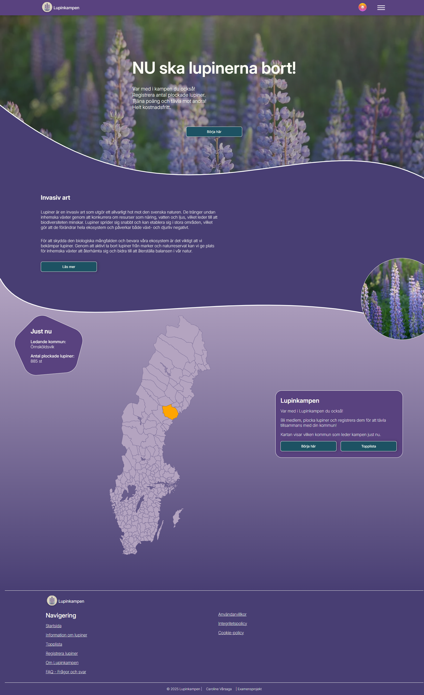

### Cookie-bar

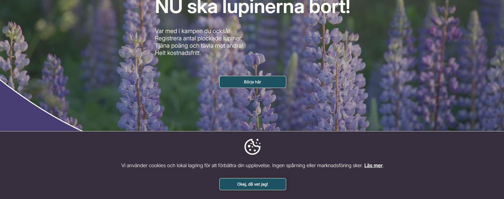

### Lupines information page

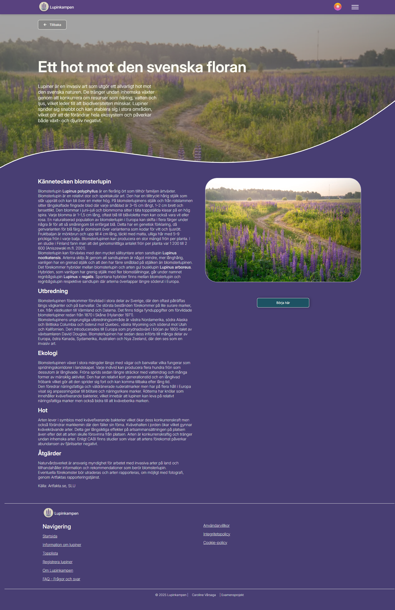

### Log in page

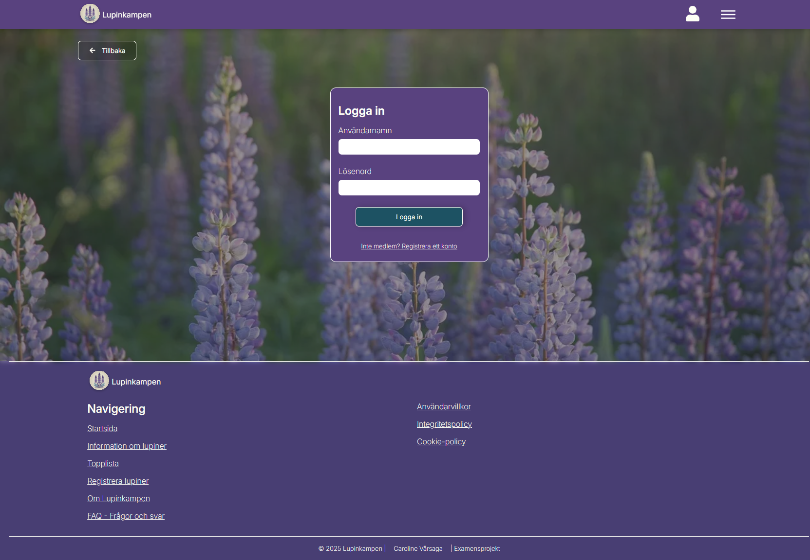

### User page

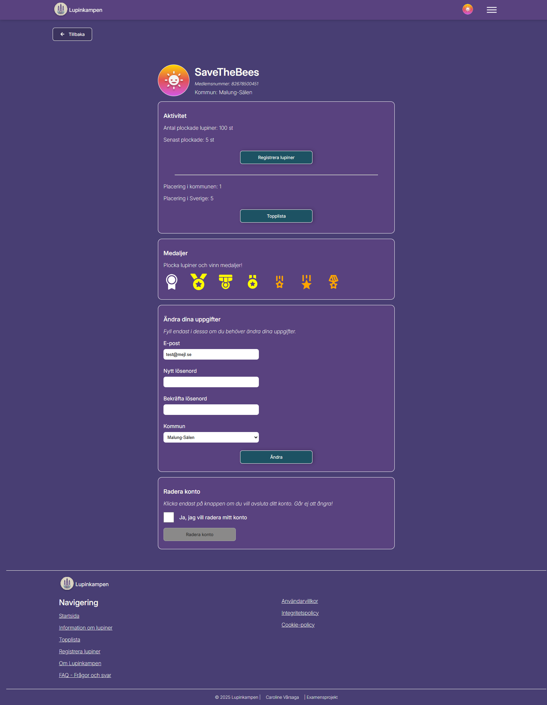

### Hovering over a medal

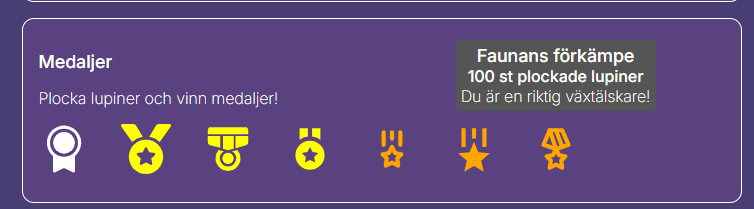

### Leaderboard page

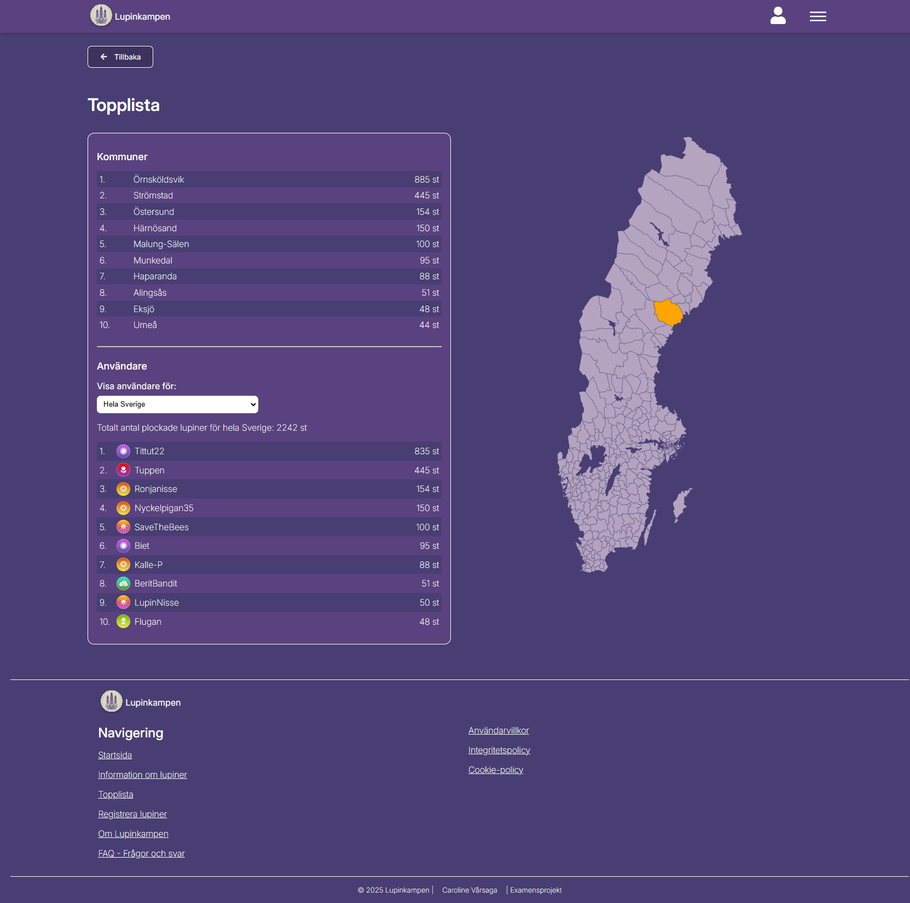

#### Click on an user on the leaderboard

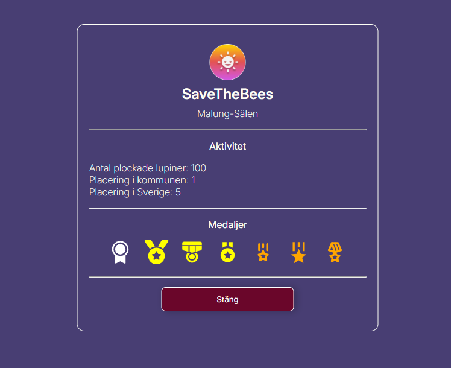

### Register lupins page

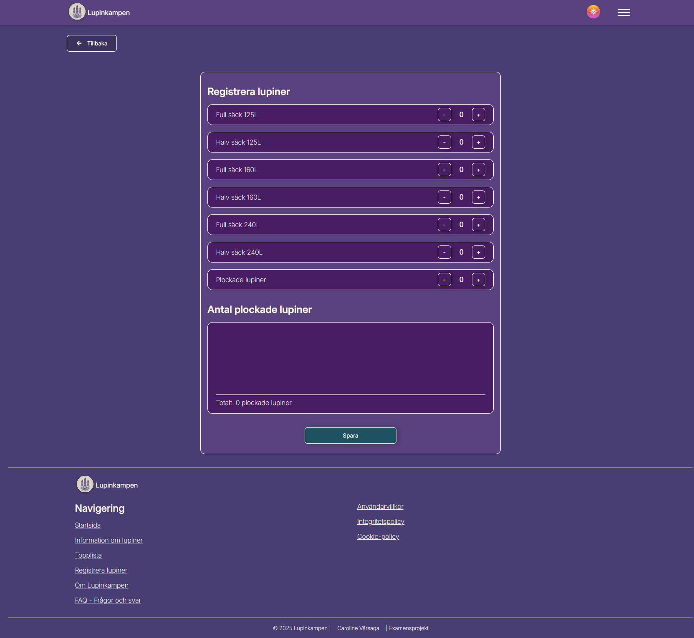

## Application Mobile

### Home page

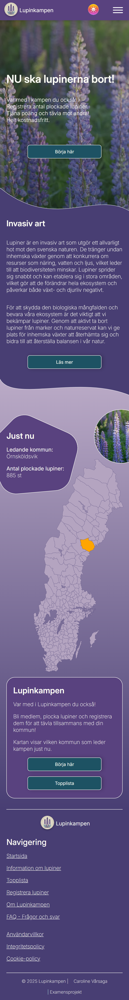

### Lupines information page

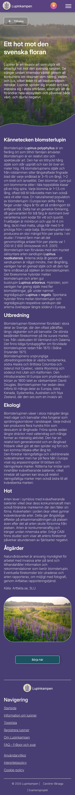

### Log in page

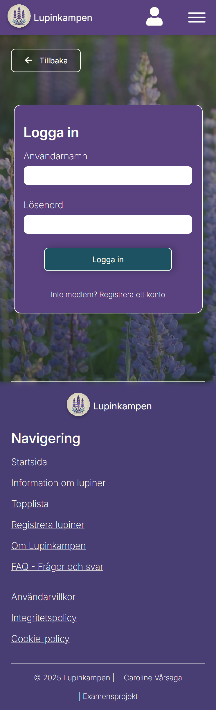

### User page

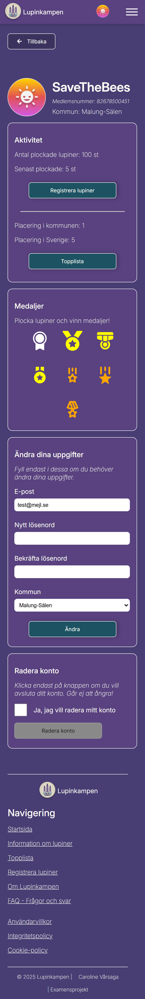

### Leaderboard page

#### Click on an user on the leaderboard

### Register lupins page

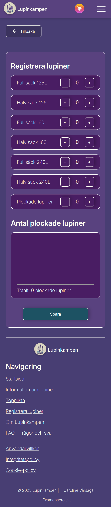

### Validation

### HTML

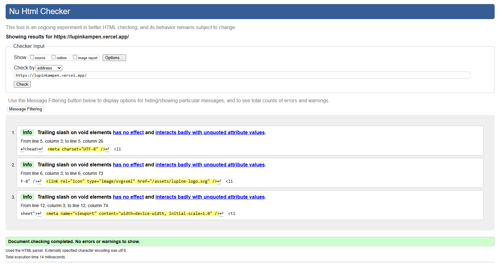
 _I have tested all pages, and the results were consistent._

### CSS

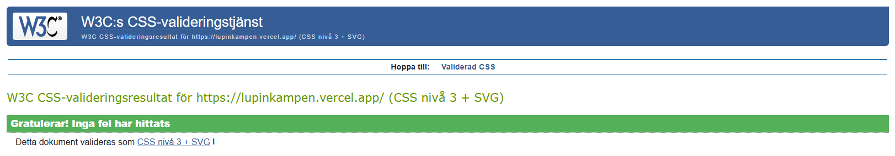
 _I have tested all pages, and the results were consistent._

### Lighthouse

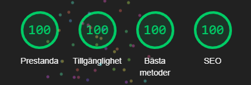
 _The parameters were all green on all pages._

## ABOUT THIS PROJECT

### _Project idea summary_

Lupinkampen is a web application where users can find useful and practical information about lupines. Users will also be able to create an account and register the amount of lupines they have picked. Additionally, users will be able to view statistics on which municipality and player has removed the most lupines. It will also be possible to join groups/associations and compete against other groups. The more lupines a user removes, the higher the chance of winning a digital medal. On the homepage and the leaderboard page, there will be an interactive map that highlights the leading municipality in lupine removal, offering a visual representation of progress and competition. The goal is to increase engagement and help eradicate an invasive species.

### _Purpose_

Lupines are an invasive species that pose a significant threat to biodiversity. They have a highly competitive nature, quickly spreading and outcompeting the native plants that would naturally grow in the same areas. This leads to a reduction in the diversity of plant life, which in turn disrupts the entire ecosystem. Native plants support a wide range of insects, including bees and pollinators, which rely on these plants for food and habitat. Lupines, however, bloom for a much shorter period than many native species. As their blooming period ends, especially toward the end of summer and into autumn, bees and other insects lose a vital food source, creating a ripple effect that impacts not just insects but also the animals that rely on them.

This issue is widespread across our long and varied country, making lupines a nationwide environmental problem. If left unchecked, they can permanently alter the landscapes they invade, diminishing the richness of our natural environments and putting pressure on ecosystems that are already vulnerable due to other factors like climate change.

The purpose of Lupinkampen is to raise awareness about the threat that lupines pose and to actively engage and motivate people to take action. By encouraging individuals and communities to work together to remove lupines, we can help restore native biodiversity and protect our ecosystems. Through collective effort, Lupinkampen aims to inspire people to take ownership of their local environments and contribute to a larger goal of eradicating lupines and preserving the health of our natural landscapes. With the combined actions of many, we can combat this invasive species and protect our local ecosystems for future generations.

### _Goal_

The expected outcome after 6 weeks is to have a fully functional, responsive web application that effectively engages users in the removal of lupines to preserve biodiversity. The homepage will be visually appealing and well-structured, providing enough information without overwhelming users. It will clearly convey the importance of removing lupines and highlight the competitive aspect of the platform.

The core objectives are to inform, motivate, and engage users taking action to protect biodiversity by removing lupines. Users should easily find the information they seek and understand the urgency of the problem. The website will guide them to create an account, log in, and register the amount of lupines they have picked.

To incentivize participation, users will earn digital medals for picking lupines, with multiple medals available for different milestones. A leaderboard will display rankings of municipalities and members, showcasing those who have removed the most lupines. Users will be able to view member profiles on the leaderboard, showing their total lupine count, earned medals, and rankings within their municipality and the country.

## ABOUT THE PROCESS AND THOUGHTS

### _Database_

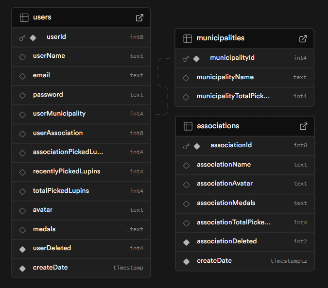

_userAssociation and associationId have a foregin key between each other, it's just not displaying here._

### _REST API_

In this project, I have created a **REST API** to manage user data, municipality data, and lupine registrations. The API uses **GET**, **POST**, and **DELETE** HTTP methods to interact with the database and manage resources.

- **GET**: Retrieve data from the server, such as user information or registered lupines.
- **POST**: Create new resources or update existing ones, such as when a user registers new lupines or updates previous entries.
- **DELETE**: Remove resources, such as when a user deletes a previously registered lupine.

The API is built with **Node.js** and **Express**, and it is designed to be easily extended with more endpoints and features as needed.

#### Endpoints

**Users**

**GET**

- /api/users/getuser/${userId}
- /api/users/topUsers
- /api/users/getTotalLupins
- /api/users/medals/${userId}
- /api/users/score/${userId}
- /api/users/scoreSweden/${userId}
- /api/users/getUsersScoreMunicipality/${municipalityId}

**POST**

- /api/users/create
- /api/users/login
- /api/users/update/${userId}
- /api/users/registerLupins/${userId}

**DELETE**

- /api/users/delete/${userId}

**Municipalities**

**GET**

- /api/municipalities/topMunicipalities
- /api/municipalities/score/${userMunicipalityId}

### _Process_

I had six weeks to develop this project.
I started by designing the application in Figma to have a foundation to work from.
After that, I set up a local MySQL database (which I later migrated to Supabase and converted to Postgres).

From there, I worked step by step, week by week. First, I built the landing page and the information page. Once that was complete, I moved on to the login and registration pages.
I developed the application in line with the flow the user would follow when navigating through the site.

> I have integrated SLU Artdatabanken's open Artfakta API into this project to fetch detailed information about lupines. The API provides valuable data, which enhances the application's functionality and allows users to access reliable and accurate information about lupine species directly within the platform.

I have a map of Sweden in SVG format with all its municipalities. The leading municipality lights up on the map. There was definitely an easier way to do this, but I couldn’t figure one out at the time (and still haven’t).
The functionality works by checking the database to see which municipality is in the lead, and then matching its ID with the ID of the corresponding municipality on the map of Sweden. The tedious part is that I had to manually go into each path and assign the ID.

### _Tests_

During the development of this project, I conducted user testing to gather valuable feedback on the application's usability and user experience. Several users were given the opportunity to test the application, and based on their interactions, I received constructive suggestions for improvements. These insights helped refine the user interface, enhance functionality, and ensure that the application met the needs of its users. The feedback process was integral in improving the overall design and flow of the application.

### _Obstacles_

It took me over three days to deploy the project to Vercel.
I later discovered that you can't deploy from a branch—it has to be from main. Lesson learned...

I also had a bug that I spent way too much time on, where user data wasn't being fetched correctly after login but worked perfectly as soon as the page was refreshed.
It turned out the token needed to be included in the fetch request. I had set it globally so multiple services could access it, but of course, it wasn’t that simple.

### _My own thoughts and reflections_

> #### Database
>
> I have built a database to link users with an association.
> My plan is to continue developing this project, including adding a dedicated page for associations.
> This feature would enable users to collect and register lupines as part of a team effort, fostering collaboration and competition between groups.

> #### Sweden Map
>
> If I ever do something similar again and have to manually assign IDs, I'll stick to counties or regions instead. They are significantly fewer than municipalities.

> #### Self-Awareness
>
> - This project showed me the importance of breaking down large tasks into smaller steps and working methodically to avoid feeling overwhelmed.
> - I've realized the importance of building an application in line with the user's flow, and this is a method I will definitely use in future projects.

> #### Time Management
>
> I noticed that I underestimated how long certain parts of the project would take, especially debugging and deployment. In the future, I will allocate more time for unforeseen issues.

> #### Technical Insights
>
> This project gave me the opportunity to work more with Postgres, which was new to me. I also learned about the differences between local and cloud-based databases.

> #### Lessons Learned
>
> I gained a deeper understanding of working with databases and how critical it is to have a well-thought-out structure before starting development.

## AUTHOR

_Caroline Vårsaga -2025_
 _Studying "Front End Developer" at Medieinstituet_

- GitHub: https://github.com/CarolineVarsaga
- LinkedIn: https://www.linkedin.com/in/caroline-varsaga
